# Claude Pipeline Orchestrator

Standalone Node.js SDLC orchestrator that drives a full feature pipeline by invoking Claude Code subagents programmatically. Ships with a live dashboard, checkpointed runs, human interrupt points, and notification channels.

Designed to be added to any project as a **git submodule**.

---

## Table of Contents

- [Prerequisites](#prerequisites)
- [Adding to a New Project](#adding-to-a-new-project)
- [Main Project Configuration](#main-project-configuration)
- [First-Time Setup](#first-time-setup)
- [Figma MCP Setup](#figma-mcp-setup)
- [Configuration](#configuration)
- [Usage](#usage)
- [Pipeline Flow](#pipeline-flow)
- [On-Demand Agents](#on-demand-agents)
- [Updating the Submodule](#updating-the-submodule)
- [Making Changes to the Orchestrator](#making-changes-to-the-orchestrator)
- [Notifications](#notifications) TODO
- [Model Assignments](#model-assignments)

---

## Prerequisites

- Node.js ≥ 20
- npm
- Claude Code CLI (`claude`) installed and authenticated
- GitHub CLI (`gh`) installed and authenticated

---

## Adding to a New Project

```bash
# From your project root
git submodule add https://github.com/stanislavmihaylov/prototype-orchestrator
git submodule update --init
```

---

## Main Project Configuration

### 1. Makefile

Add these targets and extend your existing `setup` target:

# UNIX / macOS / Git Bash
```makefile
# ─── Pipeline ─────────────────────────────────────────────────────────────────
orchestrator-setup:
	@test -n "$(STACK)" || (echo "Usage: make orchestrator-setup STACK=web|mobile"; exit 1)
	git submodule update --init
	sh prototype-orchestrator/setup.sh "$(STACK)"

pipeline-install:
	cd prototype-orchestrator && npm install

pipeline-start:
	@test -n "$(FEATURE)" || (echo "Usage: make pipeline-start FEATURE=\"<flow name>\" [SCOPE=backend|mobile|both]"; exit 1)
	cd prototype-orchestrator && npm run pipeline -- start "$(FEATURE)" $(if $(SCOPE),--scope $(SCOPE),)

pipeline-resume:
	@test -n "$(THREAD)" || (echo "Usage: make pipeline-resume THREAD=<threadId>"; exit 1)
	cd prototype-orchestrator && npm run pipeline -- resume "$(THREAD)"

pipeline-dashboard:
	cd prototype-orchestrator && npm run dashboard
```

# Windows (PowerShell — run these manually, no make required)
```powershell
# Setup
git submodule update --init
.\prototype-orchestrator\setup.ps1 -Stack web   # or -Stack mobile

# Start pipeline
cd prototype-orchestrator; npm run pipeline -- start "Feature Name"

# Resume pipeline
cd prototype-orchestrator; npm run pipeline -- resume <threadId>

# Start dashboard
cd prototype-orchestrator; npm run dashboard
```

### 2. Runtime data directory

The orchestrator writes all runtime data to `orchestrator_logs/` at the project root. Commit this directory — it gives the whole team full traceability of every pipeline run.

```bash
mkdir -p orchestrator_logs/runs orchestrator_logs/interactions orchestrator_logs/responses orchestrator_logs/logs/feedback
```

Do **not** add `orchestrator_logs/` to `.gitignore`.

### 3. `.gitignore`

Add the submodule directory so git treats it as a pointer rather than a regular folder:

```gitignore
/prototype-orchestrator/
```

---

## First-Time Setup

After adding the submodule, or after a fresh `git clone --recurse-submodules`:

```bash
# Unix / macOS / Git Bash
make orchestrator-setup STACK=web
# or
make orchestrator-setup STACK=mobile

# Windows (PowerShell)
git submodule update --init
.\prototype-orchestrator\setup.ps1 -Stack web
# or
.\prototype-orchestrator\setup.ps1 -Stack mobile
```

Then create your local config:

```bash
cp prototype-orchestrator/.env.example prototype-orchestrator/.env
# Edit prototype-orchestrator/.env with project-specific values
```

What `setup.sh` / `setup.ps1` does:
1. Removes any existing `.claude/` at the project root
2. Creates `.claude/agents/` and `.claude/skills/`
3. Copies `settings.json` from the submodule's `.claude/`
4. Copies common agents and skills (shared across stacks)
5. Copies stack-specific agents and skills on top
6. Runs `npm install` inside the prototype-orchestrator directory

After setup your project root will look like this:

```
project-root/
  .claude/                ← generated by setup, stack-specific
    agents/
    skills/
    settings.json
  prototype-orchestrator/           ← submodule
  orchestrator_logs/
    runs/
    interactions/
    responses/
    logs/
      feedback/
```

### Cloning a project that already uses this submodule

```bash
git clone --recurse-submodules <repo-url>
make orchestrator-setup STACK=web   # or STACK=mobile
cp prototype-orchestrator/.env.example prototype-orchestrator/.env
```

---

## Figma MCP Setup

The design agents (`design-discovery`, `design-analyst-flow`, `feature-implementation-frontend`) require a connected Figma MCP server. The pipeline uses the **Framelink Figma MCP server** (`figma-developer-mcp`) authenticated via a personal access token.

### 1. Generate a Figma personal access token

Go to **Figma → Settings → Security → Personal access tokens** and create a token with at least read access to your files.

### 2. Create `.mcp.json` in your project root

```json
{
  "mcpServers": {
    "figma": {
      "command": "npx",
      "args": ["-y", "figma-developer-mcp@latest", "--stdio"],
      "env": {
        "FIGMA_API_KEY": "figd_your_token_here"
      }
    }
  }
}
```

Add `.mcp.json` to your `.gitignore` to keep the token out of version control.

Restart Claude Code — it will pick up the new server automatically.

### Verifying the connection

Run `claude mcp list` — you should see `figma` listed as a connected server. The agents use `mcp__figma__get_figma_data` and `mcp__figma__download_figma_images`.

> **Why `figma-developer-mcp` and not the official OAuth plugin?** The pipeline spawns agents via `spawnSync("claude", [..., "--print"])` — completely fresh processes with no session context. OAuth-based connectors and Claude plugins (`mcp__plugin_figma_figma__*`) only work in interactive sessions. `figma-developer-mcp` is a PAT-based stdio server that starts fresh with each subprocess and is available to all pipeline agents.

---

## Configuration

| Variable | Required | Description |
|---|---|---|
| `PIPELINE_DATA_DIR` | No | Where runtime data is stored, relative to `prototype-orchestrator/`. Default: `../orchestrator_logs` |
| `HAS_DESIGN` | No | `true` if project has a Figma file; `false` for proposal-based projects. Default: `true` |
| `SKIP_ENV_CHECK` | No | Skip the environment validation step. Default: `false` |
| `FIGMA_FILE_KEY` | When `HAS_DESIGN=true` | Figma file key for the project |
| `PIPELINE_DASHBOARD_PORT` | No | Dashboard port. Default: `4242` |
| `NOTIFICATIONS_DISABLED` | No | Suppress all notifications. Default: `false` |

`prototype-orchestrator/.env` is gitignored — each project keeps its own copy. Start from the example:

```bash
cp prototype-orchestrator/.env.example prototype-orchestrator/.env
```

To override which Claude model each agent uses, edit `prototype-orchestrator/pipeline.config.json`:

```json
{
  "agents": {
    "plan-feature": "claude-opus-4-8",
    "reviewer": "claude-opus-4-8"
  }
}
```

---

## Usage

```bash
# Start the live dashboard (http://localhost:4242)
make pipeline-dashboard

# Start a pipeline run
make pipeline-start FEATURE="Claims Submission"
make pipeline-start FEATURE="Claims Submission" SCOPE=backend

# Resume after an interrupt or crash
make pipeline-resume THREAD=2026-06-10T09-52-07
```

The thread ID is printed to the terminal on start and is visible in the dashboard.

---

## Pipeline Flow

```mermaid
flowchart TD
    %% ── Project bootstrap (run once) ──────────────────────────────────────────

    START([🚀 New project]) --> STACK{Stack?}

    STACK -->|mobile| SETUP_M["orchestrator-setup STACK=mobile
    Installs mobile agent set
    design-discovery · project-setup
    feature-implementation-frontend (mobile)
    reviewer · test-runner · doc-writer"]

    STACK -->|web| SETUP_W["orchestrator-setup STACK=web
    Installs web agent set
    design-discovery · project-setup
    feature-implementation-frontend (web)
    reviewer · test-runner · doc-writer"]

    SETUP_M --> SRC
    SETUP_W --> SRC

    SRC{Source of truth?}

    SRC -->|Figma file| DD["design-discovery
    Connects to Figma MCP
    → index.md · data-model.md
    · flows/ per feature"]

    SRC -->|Proposal / PDF| PD["proposal-discovery
    Reads proposal document
    → index.md · data-model.md
    · flows/ per feature"]

    DD --> PS
    PD --> PS

    PS["project-setup
    Scaffold repo · install deps
    infrastructure · design tokens
    state management · build scripts"]

    PS --> FEAT([🔁 Run pipeline-start for each feature])

    %% ── Per-feature pipeline ───────────────────────────────────────────────────

    FEAT --> ENV

    ENV["environment-checker
    Dependencies · env vars
    database · git clean"]
    ENV -->|fail| FAIL_ENV([💥 Failed])
    ENV -->|pass| HAS_DESIGN

    HAS_DESIGN{HAS_DESIGN?}
    HAS_DESIGN -->|true| DAF["design-analyst-flow
    Figma → flows/slug.md
    layout · components · a11y"]
    HAS_DESIGN -->|false or NO_FIGMA_DESIGN| PLAN
    DAF -->|fail| FAIL_DAF([💥 Failed])
    DAF -->|pass| PLAN

    PLAN["plan-feature
    Full-stack implementation plan
    backend + frontend + shared types"]
    PLAN --> OQ{Open questions?}
    OQ -->|yes| HQ[/"⏸ Human answers questions"/]
    HQ --> PLAN
    OQ -->|no| INT1

    INT1[/"⏸ INTERRUPT 1 — Review plan
    'approved' or describe changes"/]
    INT1 -->|approved| BACK
    INT1 -->|feedback| PLAN

    BACK["feature-implementation-backend
    API · database · types sync · TDD"]
    BACK --> FRONT["feature-implementation-frontend
    Screens · state · components · TDD
    (mobile or web — set by stack)"]
    FRONT --> TEST

    TEST["test-runner
    Tests → types → lint → build"]
    TEST --> REV

    REV["reviewer
    Code quality + security review"]
    REV --> SEV{Critical or high\nfindings?}

    SEV -->|"yes (iteration 0)"| AUTOFIX["Auto-fix round
    Re-implement using
    reviewer findings"]
    AUTOFIX --> TEST2["test-runner"]
    TEST2 --> REV2["reviewer"]
    REV2 --> INT2

    SEV -->|"no, or iteration 1"| INT2

    INT2[/"⏸ INTERRUPT 2 — Approve merge
    'merge' · 'hold' · 'fix: feedback'"/]
    INT2 -->|merge| PRM
    INT2 -->|hold| HELD([⏸ Held — resume later])
    INT2 -->|"fix: feedback"| REPLAN["plan-feature
    Re-plan with fix context"]
    REPLAN --> BACK

    PRM["pr-manager
    Verify branch + clean tree
    push → open pull request
    marks tasks.md ✓"]
    PRM -->|success| DONE([✅ Feature done])
    PRM -->|fail| FAIL_PR([💥 PR failed — tasks.md unchanged])

    %% ── Styles ─────────────────────────────────────────────────────────────────
    classDef once    fill:#dbeafe,stroke:#3b82f6,color:#1e3a5f
    classDef agent   fill:#f0fdf4,stroke:#22c55e,color:#14532d
    classDef human   fill:#fef9c3,stroke:#eab308,color:#713f12
    classDef fail    fill:#fee2e2,stroke:#ef4444,color:#7f1d1d
    classDef done    fill:#dcfce7,stroke:#16a34a,color:#14532d
    classDef decide  fill:#f5f3ff,stroke:#8b5cf6,color:#3b0764

    class DD,PD,PS once
    class ENV,DAF,PLAN,BACK,FRONT,TEST,REV,AUTOFIX,TEST2,REV2,PRM agent
    class SETUP_M,SETUP_W once
    class INT1,INT2,HQ human
    class FAIL_ENV,FAIL_DAF,FAIL_PR fail
    class DONE,FEAT done
    class STACK,SRC,HAS_DESIGN,OQ,SEV decide
```



---

## On-Demand Agents

Invoked manually via the Claude Code CLI, outside the pipeline:

| Agent | When to run | Purpose |
|---|---|---|
| `design-discovery` | Once at project start (Figma projects) | Figma → `docs/blueprint/index.md` + `data-model.md` + `flows/` per feature |
| `proposal-discovery` | Once at project start (non-Figma projects) | Proposal doc → full `docs/blueprint/` foundation |
| `project-setup` | Once after discovery | Scaffold repo, install deps, infrastructure, design tokens, build scripts |
| `doc-writer` | After each feature is merged | Updates `docs/api.md`, `docs/features/<slug>.md`, `docs/architecture.md` |
| `process-improver` | Every 3–5 features | Reads feedback logs, patches agent prompts, skills, and CLAUDE.md |

---

## Updating the Submodule

```bash
# Pull latest from the orchestrator repo
git submodule update --remote prototype-orchestrator

# Review what changed
git diff prototype-orchestrator

# Commit the updated pin
git add prototype-orchestrator
git commit -m "chore: update prototype-orchestrator submodule"
git push
```

After updating, check `prototype-orchestrator/.env.example` for any new variables to add to your local `.env`.

---

## Making Changes to the Orchestrator

Changes to agents, skills, pipeline logic, or the dashboard belong in the orchestrator repo — not in the consuming project.

```bash
# Work inside the submodule
cd prototype-orchestrator
git checkout -b fix/my-change

# Make changes, commit, push
git add .
git commit -m "fix: description"
git push origin fix/my-change

# Open a PR in the orchestrator repo and merge it
# Then back in the consuming project, update the pin:
cd ..
git submodule update --remote prototype-orchestrator
git add prototype-orchestrator
git commit -m "chore: update prototype-orchestrator submodule"
git push
```

Never commit prototype-orchestrator source changes from the consuming project root — they update only the submodule pointer, not the prototype-orchestrator repo itself.

---

## Notifications (TODO)

All channels are optional — any channel without config is silently skipped.

| Channel | Env vars |
|---|---|
| Slack | `SLACK_WEBHOOK_URL` |
| Microsoft Teams | `TEAMS_WEBHOOK_URL` |
| Email | `SMTP_HOST`, `SMTP_PORT`, `SMTP_USER`, `SMTP_PASSWORD`, `NOTIFY_EMAIL_TO`, `NOTIFY_EMAIL_FROM` |

For Office 365: `SMTP_HOST=smtp.office365.com`, `SMTP_PORT=587`.

---

## Model Assignments

| Agent | Default model |
|---|---|
| `design-analyst-flow` | `claude-sonnet-4-6` |
| `plan-feature` | `claude-opus-4-8` |
| `feature-implementation-backend` | `claude-sonnet-4-6` |
| `feature-implementation-frontend` | `claude-sonnet-4-6` |
| `test-runner` | `claude-sonnet-4-6` |
| `reviewer` | `claude-opus-4-8` |
| All on-demand agents | `claude-sonnet-4-6` |

Override any assignment in `prototype-orchestrator/pipeline.config.json`.
